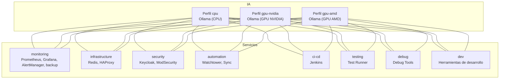

<!--
🌐 Idioma: Español | [English](README.md)
-->

> **Esta documentación está en español. La versión principal en inglés está en [README.md](README.md).**

# My Self-Hosted AI Kit (Kit de IA Auto-hospedado)

Un stack completo de herramientas de Inteligencia Artificial auto-hospedadas usando Docker Compose. Este proyecto incluye Ollama para modelos de lenguaje local, n8n para automatización, Open WebUI para interfaz de chat, y más.

## 🚀 ¿Qué incluye este stack?

### Servicios principales:
- **Ollama**: Servidor de modelos de lenguaje local (LLMs)
- **Open WebUI** (v0.7.2): Interfaz web moderna para chat con IA
- **n8n** (v1.122.5): Plataforma de automatización de flujos de trabajo
- **PostgreSQL**: Base de datos para n8n y Keycloak
- **Qdrant**: Base de datos vectorial para embeddings
- **Redis**: Caché y gestión de sesiones
- **pgvector**: Extensión de PostgreSQL para vectores

> **Nota**: Las versiones de los servicios están fijadas para estabilidad. Ver `docker-compose.yml` para versiones exactas.

### Servicios opcionales:
- **Automatic Backup Runner**: Respaldo diario automatizado y auto-contenido (perfil `monitoring`)
- **Herramientas de desarrollo**: Contenedor con utilidades (perfil `dev`)

### Modelos de IA incluidos:
- llama3.2 (3.2B parámetros - más rápido, menos preciso)
- llama3.3 (70.6B parámetros - más lento, más preciso)
- all-minilm (modelo de embeddings, se actualiza automáticamente)
- deepseek-r1:14b (modelo especializado, optimizado para 16GB VRAM)
- nomic-embed-text (embeddings de texto, se actualiza automáticamente)

## 📋 Prerrequisitos

### Software necesario:
- **Docker Engine** (no Docker Desktop)
- **Docker Compose**
- **Git** (para clonar el repositorio)
- **jq** (para procesar JSON en scripts de pruebas)
- **curl** (para pruebas de API)

**Instalación Rápida (Ubuntu/Debian):**
```bash
# 1. Instalar Docker
curl -fsSL https://get.docker.com | sh
sudo usermod -aG docker $USER
# (Cierra sesión y vuelve a entrar para aplicar cambios)

# 2. Instalar Herramientas (Git, jq, curl)
sudo apt-get update && sudo apt-get install -y git jq curl
```

### Hardware recomendado:
- **RAM**: Mínimo 8GB, recomendado 16GB+
- **GPU**: NVIDIA con drivers propietarios (recomendado: GPU con 8GB+ VRAM)
- **CPU**: Mínimo 4 cores, recomendado 8+ cores
- **Almacenamiento**: Al menos 50GB libres (los modelos de IA son grandes)

## 🛠️ Instalación

### 1. Clonar el repositorio
```bash
git clone <tu-repositorio>
cd my-selfhosted-ai-kit
```

### 2. Configurar variables de entorno
Crea un archivo `.env` en la raíz del proyecto:
```bash
cp .env.example .env
# Edita el archivo con tu editor favorito
nano .env
```

**CRÍTICO**: Asegúrate de configurar tu información en la sección `OIDC User Emulation`. Estos valores se usarán para generar automáticamente tu perfil local en Open WebUI:
- `OPEN_WEBUI_OIDC_USER_EMAIL`: Tu correo de admin
- `OPEN_WEBUI_OIDC_USER_NAME`: Tu nombre completo

Consulta la [**Guía de Configuración**](docs/CONFIGURATION.md) para más detalles sobre la generación dinámica.

# Configuración de n8n
N8N_ENCRYPTION_KEY=tu_clave_de_encriptacion_32_caracteres
N8N_USER_MANAGEMENT_JWT_SECRET=tu_jwt_secret_seguro
```

### 3. Configurar GPU (opcional)
Si tienes GPU NVIDIA y quieres aceleración:

```bash
# Instalar nvidia-container-toolkit
sudo apt-get install -y nvidia-container-toolkit
sudo systemctl restart docker

# Verificar que funciona
sudo docker run --rm --gpus all nvidia/cuda:12.0.0-base-ubuntu22.04 nvidia-smi
```

## 🚀 Uso

### Recomendado: Usar el Script Stack Manager

El proyecto incluye un script mejorado `stack-manager.sh` con **resolución automática de dependencias**. Cuando inicias un perfil, automáticamente incluye todas las dependencias requeridas:

```bash
# Iniciar Open WebUI con todas sus dependencias (Keycloak, Redis, Ollama)
./scripts/stack-manager.sh start chat-ai
# Auto-incluye: security infrastructure gpu-nvidia

# Iniciar automatización con autenticación
./scripts/stack-manager.sh start automation
# Auto-incluye: security

# Iniciar el preset por defecto (recomendado para producción)
./scripts/stack-manager.sh start

# Detener todos los servicios
./scripts/stack-manager.sh stop

# Ver presets y perfiles disponibles
./scripts/stack-manager.sh list

# Modo debug (ver resolución de perfiles)
DEBUG_PROFILES=true ./scripts/stack-manager.sh start chat-ai
```

### Perfiles disponibles

El stack incluye diferentes perfiles para optimizar según tus necesidades:

#### Perfil básico (CPU):
```bash
docker compose --profile cpu up -d
```

#### Perfil GPU NVIDIA (recomendado si tienes GPU NVIDIA):
```bash
docker compose --profile gpu-nvidia up -d
```

#### Perfil GPU AMD:
```bash
docker compose --profile gpu-amd up -d
```

#### Perfil de desarrollo:
```bash
docker compose --profile dev up -d
```

#### Perfil de monitoreo y respaldos:
```bash
docker compose --profile monitoring up -d
```

#### Perfil de infraestructura (Redis, HAProxy):
```bash
docker compose --profile infrastructure up -d
```

#### Perfil de seguridad (Keycloak, ModSecurity):
```bash
docker compose --profile security up -d
```

#### Perfil de automatización (Watchtower, Sync):
```bash
docker compose --profile automation up -d
```

#### Perfil de CI/CD (Jenkins):
```bash
docker compose --profile ci-cd up -d
```

#### Perfil de testing:
```bash
docker compose --profile testing up -d
```

#### Perfil de debugging:
```bash
docker compose --profile debug up -d
```

#### Combinar múltiples perfiles:
```bash
# Producción completa con GPU, monitoreo e infraestructura
docker compose --profile gpu-nvidia --profile monitoring --profile infrastructure up -d

# Desarrollo con herramientas y testing
docker compose --profile cpu --profile dev --profile testing up -d

# Stack completo (¡cuidado con el uso de recursos!)
docker compose --profile gpu-nvidia --profile monitoring --profile infrastructure --profile security --profile automation up -d
```

## 🧩 ¿Qué hace cada perfil y cómo usarlos?

| Perfil           | ¿Qué incluye?                                                                 | ¿Cuándo usarlo?                                                                                   | ¿Se recomienda combinar?         |
|------------------|-------------------------------------------------------------------------------|---------------------------------------------------------------------------------------------------|----------------------------------|
| **cpu**          | Ollama (CPU)                                                                  | No tienes GPU o quieres ahorrar recursos.                                                         | Sí, con otros servicios.         |
| **gpu-nvidia**   | Ollama (GPU NVIDIA), model puller, nvidia-exporter                            | Tienes GPU NVIDIA y quieres máximo rendimiento en IA.                                             | Sí, con otros servicios.         |
| **gpu-amd**      | Ollama (GPU AMD)                                                              | Tienes GPU AMD compatible.                                                                        | Sí, con otros servicios.         |
| **chat-ai**      | Open WebUI                                                                    | Interfaz de chat IA con autenticación Keycloak.                                                   | Auto-incluye: security, infrastructure, gpu-nvidia |
| **monitoring**   | Prometheus, Grafana, AlertManager, backup, exporters (node, cAdvisor, postgres, redis, ollama, n8n, openwebui) | Quieres monitoreo, dashboards y respaldos automáticos.                                            | Auto-incluye: security, infrastructure |
| **infrastructure**| Redis, HAProxy                                                               | Necesitas cache o balanceo de carga.                                                              | Sí, con cualquier perfil.        |
| **security**     | Keycloak, keycloak-init, ModSecurity (WAF)                                    | Quieres autenticación centralizada y firewall de aplicaciones web.                                | Sí, con cualquier perfil.        |
| **automation**   | n8n, Watchtower (auto-actualización), Sync                                    | Quieres automatización de workflows y actualizaciones de contenedores.                            | Auto-incluye: security           |
| **ci-cd**        | Jenkins (puerto 8081→8082)                                                    | Necesitas pipelines de integración y despliegue continuo.                                         | Auto-incluye: security           |
| **gen-ai**       | Keycloak, Jenkins                                                             | Servicios de IA combinados con autenticación.                                                     | Alias para security + ci-cd      |
| **testing**      | Test Runner                                                                   | Quieres monitoreo automático de salud de servicios.                                               | Sí, con cualquier perfil.        |
| **debug**        | Debug Tools                                                                   | Necesitas herramientas avanzadas de debugging.                                                    | Sí, con cualquier perfil.        |
| **dev**          | Herramientas de desarrollo (curl, jq, etc.)                                   | Estás desarrollando o depurando el stack.                                                         | Sí, con cualquier perfil.        |

---

### 🔑 ¿Debo levantar más de un perfil a la vez?

**¡Sí!**  
Cada perfil es modular y **debes combinarlos** según tus necesidades.  
Por ejemplo, si solo levantas `security`, tendrás Keycloak y ModSecurity, pero **no tendrás IA, ni monitoreo, ni automatización**.

#### Ejemplos de combinaciones recomendadas:

- **Desarrollo básico (sin GPU):**
  ```bash
  docker compose --profile cpu --profile dev up -d
  ```
- **IA con GPU y monitoreo:**
  ```bash
  docker compose --profile gpu-nvidia --profile monitoring up -d
  ```
- **Producción completa (IA, monitoreo, seguridad, infraestructura):**
  ```bash
  docker compose --profile gpu-nvidia --profile monitoring --profile infrastructure --profile security up -d
  ```
- **Solo autenticación y seguridad:**
  ```bash
  docker compose --profile security up -d
  ```

### 🗺️ Diagrama visual de perfiles y dependencias



### 🖼️ Versión en imagen


### 🗒️ Leyenda de colores del diagrama

- **Líneas azules**: Conexiones desde el perfil `cpu`
- **Líneas verdes**: Conexiones desde el perfil `gpu-nvidia`
- **Líneas naranjas**: Conexiones desde el perfil `gpu-amd`
- **Líneas moradas**: Servicios de monitoreo (`monitoring`)
- **Líneas rojas**: Servicios de seguridad (`security`)
- **Líneas marrones**: Servicios de infraestructura (`infrastructure`)
- **Líneas celestes**: Servicios de automatización (`automation`)
- **Líneas gris oscuro**: Servicios de CI/CD (`ci-cd`)
- **Líneas verde lima**: Servicios de testing (`testing`)
- **Líneas rosas**: Servicios de debugging (`debug`)
- **Líneas amarillas**: Herramientas de desarrollo (`dev`)

---

### Ver logs en tiempo real:
```bash
docker compose logs -f
```

### Gestionar el stack con el script maestro:
```bash
# Levantar servicios (por defecto: gpu-nvidia + monitoring + infrastructure + security)
./scripts/stack-manager.sh start

# Levantar con perfiles específicos
./scripts/stack-manager.sh start gpu-nvidia monitoring

# Ver estado
./scripts/stack-manager.sh status

# Ver ayuda
./scripts/stack-manager.sh help
```

### Monitorear descarga de modelos:
```bash
./scripts/stack-manager.sh monitor
```

### Detener todos los servicios:
```bash
docker compose down
# O usando stack-manager:
./scripts/stack-manager.sh stop
```

## 🌐 Acceso a las aplicaciones

Una vez que los servicios estén corriendo, puedes acceder a:

| Servicio | Via HAProxy (recomendado) | Puerto Directo | Descripción |
|----------|---------------------------|----------------|-------------|
| **Open WebUI** | http://localhost/chat | http://localhost:3000 | Interfaz web para chat con IA |
| **n8n** | ⏳ Pendiente | http://localhost:5678 | Automatización de flujos de trabajo |
| **Grafana** | http://localhost/grafana | http://localhost:3001 | Dashboards de monitoreo (Auth via Keycloak) |
| **Prometheus** | http://localhost/prometheus | http://localhost:9090 | Métricas del sistema |
| **AlertManager** | http://localhost/alertmanager | http://localhost:9093 | Gestión de alertas |
| **Keycloak** | ⏳ Pendiente | http://localhost:8080 | Autenticación centralizada |
| **Jenkins** | - | http://localhost:8081 | CI/CD Pipeline |
| **Qdrant** | - | http://localhost:6333 | Base de datos vectorial |
| **pgvector** | - | localhost:5433 | PostgreSQL con vectores |
| **cAdvisor** | - | http://localhost:8082 | Métricas de contenedores |
| **Node Exporter** | - | http://localhost:9100 | Métricas del host |
| **Redis** | - | localhost:6379 | Cache y sesiones |

<!-- TODO: Configurar paths de HAProxy para n8n (/n8n) y Keycloak (/keycloak) en haproxy/haproxy.cfg -->

> **Nota**: HAProxy (puerto 80) proporciona balanceo de carga, rate limiting y acceso unificado. Los puertos directos omiten estas características pero funcionan para desarrollo/debugging. Los elementos marcados "⏳ Pendiente" requieren configuración de HAProxy.

## 📚 Guía de uso por servicio

### Open WebUI
- **Propósito**: Interfaz web moderna para interactuar con modelos de IA
- **Primer uso**: 
  1. Ve a http://localhost:3000
  2. Crea una cuenta o inicia sesión
  3. Selecciona un modelo de la lista
  4. ¡Comienza a chatear!

### n8n
- **Propósito**: Automatizar tareas y flujos de trabajo
- **Primer uso**:
  1. Ve a http://localhost:5678
  2. Completa la configuración inicial
  3. Crea tu primer workflow
  4. Conecta con Ollama para usar IA en tus automatizaciones

### Ollama
- **Propósito**: Servidor de modelos de lenguaje local
- **API**: http://localhost:11434
- **Modelos disponibles**: Ejecuta `docker exec ollama ollama list`
- **Optimizado para**: GPUs NVIDIA con 8GB+ VRAM

## 🔧 Comandos útiles

### Usando el gestor del stack (recomendado):
```bash
# Levantar servicios con preset por defecto
./scripts/stack-manager.sh start

# Ver estado de servicios
./scripts/stack-manager.sh status

# Ver logs
./scripts/stack-manager.sh logs [nombre-servicio]

# Reiniciar servicios
./scripts/stack-manager.sh restart [perfiles...]

# Validar configuración
./scripts/stack-manager.sh validate

# Ejecutar validación automática completa
./scripts/stack-manager.sh auto-validate

# Probar cambios recientes
./scripts/stack-manager.sh test

# Inicializar volúmenes (solo primera vez)
./scripts/stack-manager.sh init-volumes

# Monitorear descarga de modelos
./scripts/stack-manager.sh monitor
```

### Comandos directos de Docker Compose:
```bash
# Ver estado de servicios
docker compose ps

# Ver logs de un servicio específico
docker compose logs -f [nombre-servicio]
# Ejemplo: docker compose logs -f ollama

# Reiniciar un servicio
docker compose restart [nombre-servicio]

# Ver uso de recursos
docker stats

# Limpiar espacio (eliminar imágenes no usadas)
docker system prune -a
```

### 🔐 Gestión de Keycloak:
```bash
# Configurar roles (salta automáticamente los existentes)
./scripts/auth-manager.sh --setup-roles

# Crear usuario administrador
./scripts/auth-manager.sh --create-admin

# Corregir clientes OIDC
./scripts/auth-manager.sh --fix-clients

# Ver estado
./scripts/auth-manager.sh --status

# Ver ayuda
./scripts/auth-manager.sh --help
```

## 📁 Estructura de volúmenes

Todos los datos se almacenan en volúmenes persistentes de Docker:

- `n8n_storage`: Datos de n8n (workflows, credenciales)
- `ollama_storage`: Modelos de IA descargados
- `postgres_storage`: Base de datos PostgreSQL
- `qdrant_storage`: Base de datos vectorial
- `open_webui_storage`: Datos de Open WebUI
- `backup_data`: Respaldo automático de datos
- `prometheus_data`: Métricas de monitoreo (opcional)
- `grafana_data`: Dashboards de Grafana (opcional)

## 🔧 Servicios adicionales

### Infraestructura (perfil `infrastructure`)
- **Redis**: Cache en memoria para mejorar rendimiento
- **HAProxy**: Load balancer con características avanzadas:
  - Health checks avanzados (inter 3s, fall 3, rise 2)
  - Rate limiting (100 req/10s por IP) - Protección DDoS
  - Routing basado en paths (backends específicos por servicio)
  - Timeouts optimizados
  - Logging - Estadísticas y logging mejorados
  - **Cola de Peticiones GPU**: Previene OOM poniendo en cola las inferencias (`maxconn 1`)
  - Opciones de balanceo mejoradas

### Monitoreo (perfil `monitoring`)
- **Prometheus**: Recolector de métricas
- **Grafana**: Dashboards pre-configurados:
  - **Ollama AI Models Dashboard**: Monitoreo específico de modelos de IA
  - **System Overview**: Vista general del sistema completo
- **AlertManager**: Gestión de alertas
- **Node Exporter**: Métricas del host
- **cAdvisor**: Métricas de contenedores
- **PostgreSQL Exporter**: Métricas de PostgreSQL

### Seguridad (perfil `security`)
- **Keycloak**: Autenticación y autorización centralizada
- **ModSecurity**: Firewall de aplicaciones web (WAF)

### Automatización (perfil `automation`)
- **Watchtower**: Actualizaciones automáticas de contenedores
- **Sync**: Sincronización automática de datos

### CI/CD (perfil `ci-cd`)
- **Jenkins**: Pipeline de integración y despliegue continuo

### Testing (perfil `testing`)
- **Test Runner**: Monitoreo automático de salud de servicios

### Debug (perfil `debug`)
- **Debug Tools**: Herramientas avanzadas de debugging

## 🚀 Optimización para tu hardware

Ejemplo de especificaciones probadas:
- **CPU**: AMD Ryzen 7 7700 (8 cores, 16 threads) o equivalente
- **RAM**: 32GB+ DDR5 (probado con 96GB)
- **GPU**: NVIDIA RTX serie 40/50 con 16GB VRAM

### Configuraciones recomendadas:

#### Para máximo rendimiento:
```bash
# Stack completo con GPU
docker compose --profile gpu-nvidia --profile monitoring --profile infrastructure up -d
```

#### Para desarrollo:
```bash
# Stack de desarrollo con herramientas
docker compose --profile cpu --profile dev --profile testing up -d
```

#### Para producción:
```bash
# Stack de producción con seguridad
docker compose --profile gpu-nvidia --profile monitoring --profile infrastructure --profile security up -d
```

## 🔒 Seguridad

### Recomendaciones:
1. **Cambia las contraseñas por defecto** en el archivo `.env`
2. **No expongas los puertos** a Internet sin configuración adicional
3. **Usa HTTPS** en producción
4. **Mantén actualizados** los contenedores

### Variables sensibles:
- `POSTGRES_PASSWORD`: Contraseña de la base de datos
- `N8N_ENCRYPTION_KEY`: Clave para encriptar datos de n8n
- `N8N_USER_MANAGEMENT_JWT_SECRET`: Clave para tokens JWT

## 🐛 Solución de problemas

### Problema: "Cannot connect to Docker daemon"
```bash
sudo systemctl start docker
sudo usermod -aG docker $USER
# Cierra sesión y vuelve a entrar
```

### Problema: GPU no funciona
```bash
# Verificar drivers NVIDIA
nvidia-smi

# Verificar runtime de Docker
sudo docker run --rm --gpus all nvidia/cuda:12.0.0-base-ubuntu22.04 nvidia-smi
```

### Problema: Modelos no se descargan
```bash
# Ver logs del contenedor de descarga
docker logs ollama-pull-llama

# Descargar manualmente
docker exec -it ollama ollama pull llama3.2
```

### Problema: Puerto ya en uso
```bash
# Ver qué usa el puerto
sudo netstat -tulpn | grep :3000

# Cambiar puerto en docker-compose.yml
```

### Problema: Keycloak Login Fallido ("Failed to get token")
Esto usualmente significa que los secretos del cliente Keycloak no coinciden.
```bash
# Forzar actualización de secretos de clientes (keycloak-init se ejecuta automáticamente al iniciar)
# Si necesitas ejecutarlo manualmente:
docker compose --profile security up -d keycloak-init

# O simplemente reinicia el perfil security (keycloak-init se ejecutará automáticamente)
./scripts/stack-manager.sh restart security
```

### Problema: Grafana Login Fallido ("InternalError")
Esto usualmente ocurre si el usuario de Keycloak no tiene dirección de email.
```bash
# Establecer email para el usuario admin
docker exec keycloak /opt/keycloak/bin/kcadm.sh update users/$(docker exec keycloak /opt/keycloak/bin/kcadm.sh get users -r master -q username=admin --fields id --format csv --noquotes) -r master -s email=admin@example.com -s emailVerified=true
```

### Problema: Grafana Login Fallido ("User sync failed")
Esto ocurre si Grafana no puede mapear el usuario de Keycloak a un usuario local existente.
**Asegúrate de que el email del admin de Grafana coincida con el email del admin de Keycloak.**
1. Verifica el email en Keycloak (ej: `admin@example.com`).
2. Actualiza `.env` para que coincida:
   ```bash
   GRAFANA_ADMIN_EMAIL=admin@example.com
   ```
3. Reinicia Grafana:
   ```bash
   ./scripts/stack-manager.sh start
   ```

### Problema: Logs muy grandes
```bash
# Los logs están configurados para rotar automáticamente
# Si necesitas limpiar manualmente:
docker system prune -f
```

## 📈 Monitoreo y mantenimiento

### Verificar salud de los servicios:
```bash
docker compose ps
```

### Backup de datos:
```bash
# Crear backup (recomendado)
./scripts/backup-manager.sh backup

# Crear backup completo con verificación
./scripts/backup-manager.sh backup --full --verify

# Listar backups disponibles
./scripts/backup-manager.sh list

# Restaurar desde backup
./scripts/backup-manager.sh restore <timestamp>

# Ver ayuda
./scripts/backup-manager.sh help
```

### Actualizar servicios:
```bash
docker compose pull
docker compose up -d
```

### Monitorear uso de recursos:
```bash
# Ver uso en tiempo real
docker stats

# Ver logs de todos los servicios
docker compose logs -f
```

## 🛠️ Servicios opcionales

### Perfil de Monitoreo (`monitoring`)
El perfil `monitoring` agrega un stack completo de monitoreo y observabilidad:

#### Prometheus - Recolector de métricas
- **URL**: http://localhost/prometheus (via HAProxy) o http://localhost:9090 (directo)
- **Función**: Recolecta métricas de todos los servicios del stack
- **Métricas incluidas**: CPU, memoria, estado de salud, logs de errores

#### Grafana - Dashboards y visualización
- **URL**: http://localhost/grafana (via HAProxy) o http://localhost:3001 (directo)
- **Autenticación**: Via Keycloak OAuth - clic en "Sign in with Keycloak"
- **Nota**: El login local está deshabilitado. Usa tus credenciales de Keycloak.
- **Función**: Dashboards visuales para monitorear el rendimiento
- **Dashboards incluidos**: Métricas de servicios, uso de recursos, estado de salud

#### AlertManager - Gestión de alertas
- **URL**: http://localhost/alertmanager (via HAProxy) o http://localhost:9093 (directo)
- **Función**: Gestiona alertas cuando los servicios tienen problemas
- **Alertas configuradas**: Servicios caídos, alto uso de recursos, errores críticos

#### Backup automático
- **Función**: Respalda datos diariamente
- **Ubicación**: Volumen `backup_data`
- **Frecuencia**: Cada 24 horas

### Herramientas de desarrollo
- **Perfil**: `dev`
- **Función**: Contenedor con curl, jq y otras utilidades
- **Uso**: Para debugging y desarrollo

### Cómo usar el monitoreo:

```bash
# Levantar stack completo con monitoreo
docker compose --profile gpu-nvidia --profile monitoring up -d

# Acceder a Grafana
# 1. Ve a http://localhost/grafana (o http://localhost:3001 directo)
# 2. Clic en "Sign in with Keycloak" y usa tus credenciales de Keycloak
# 3. Explora los dashboards disponibles

# Acceder a Prometheus
# 1. Ve a http://localhost/prometheus (o http://localhost:9090 directo)
# 2. Ve a Status > Targets para ver servicios monitoreados
# 3. Usa la pestaña Graph para consultar métricas

# Ver alertas
# 1. Ve a http://localhost/alertmanager (o http://localhost:9093 directo)
# 2. Revisa alertas activas y configuración
```

## 🤝 Contribuir

1. Fork el proyecto
2. Crea una rama para tu feature
3. Commit tus cambios
4. Push a la rama
5. Abre un Pull Request

## 📄 Licencia

Este proyecto está bajo la Licencia Apache 2.0. Ver el archivo `LICENSE` para más detalles.

## 🆘 Soporte

Si tienes problemas:
1. Revisa la sección de solución de problemas
2. Consulta [docs/INDEX.md](docs/INDEX.md) para guía de documentación
3. Busca en los issues del repositorio
4. Crea un nuevo issue con detalles del problema

---

## 📚 Documentación Adicional

Para más información, consulta:
- **[docs/INDEX.md](docs/INDEX.md)** - Guía de lectura de toda la documentación
- **[PROJECT_STATUS.md](docs/PROJECT_STATUS.md)** - ⭐ **NUEVO** - Estado del proyecto y tareas pendientes
- **[ROADMAP.md](docs/ROADMAP.md)** - ⭐ **NUEVO** - Hoja de ruta y plan de acción detallado

---

## 📊 Ejemplos visuales de stacks típicos

A continuación se muestran ejemplos visuales de combinaciones de perfiles para distintos escenarios de uso. Los diagramas fuente (.mmd) están en la carpeta `diagrams_mmd/` y los PNG en `diagrams_png/`.

### Stack mínimo para desarrollo

- Solo los servicios esenciales para desarrollo local sin GPU.

### Stack de producción completo

- Incluye IA con GPU, monitoreo, seguridad e infraestructura.

### Solo autenticación y seguridad

- Para cuando solo quieres levantar Keycloak y ModSecurity.

### IA con GPU y monitoreo

- Para pruebas de rendimiento y observabilidad.

### Stack de automatización y CI/CD

- Para flujos automáticos y pipelines de integración continua.

### Stack de debugging y testing

- Para monitoreo de salud y depuración avanzada.

### Stack completo (todos los servicios)

- Todos los servicios del stack levantados simultáneamente.

---

**¿Quieres crear tus propios diagramas o modificar los existentes?**
Consulta el archivo [`docs/DIAGRAMS_INSTRUCTIONS.es.md`](docs/DIAGRAMS_INSTRUCTIONS.es.md) para aprender cómo generar los PNG a partir de los archivos `.mmd` usando Mermaid CLI. 
