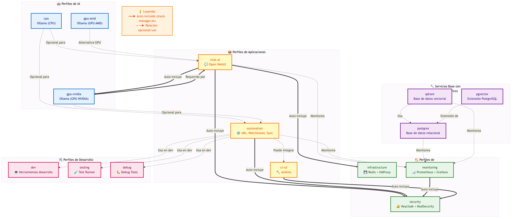

<!--
🌐 Idioma: Español | [English](README.md)
-->

> **Esta documentación está en español. La versión principal en inglés está en [README.md](README.md).**

# My Self-Hosted AI Kit (Kit de IA Auto-hospedado)

Un stack completo de herramientas de Inteligencia Artificial auto-hospedadas usando Docker Compose. Este proyecto incluye Ollama para modelos de lenguaje local, n8n para automatización, Open WebUI para interfaz de chat, y más.

## 🚀 ¿Qué incluye este stack?

### Servicios principales:
- **Ollama**: Servidor de modelos de lenguaje local (LLMs)
- **Open WebUI**: Interfaz web moderna para chat con IA
- **n8n**: Plataforma de automatización de flujos de trabajo
- **PostgreSQL**: Base de datos para n8n
- **Qdrant**: Base de datos vectorial para embeddings
- **pgvector**: Extensión de PostgreSQL para vectores

### Servicios opcionales:
- **Backup automático**: Respaldo diario de datos (perfil `monitoring`)
- **Herramientas de desarrollo**: Contenedor con utilidades (perfil `dev`)

### Modelos de IA incluidos:
- llama3.2 (modelo base)
- llama3.3 (modelo más avanzado)
- all-minilm (modelo de embeddings)
- deepseek-r1:14b (modelo especializado)
- nomic-embed-text (embeddings de texto)

## 📋 Prerrequisitos

### Software necesario:
- **Docker Engine** (no Docker Desktop)
- **Docker Compose**
- **Git** (para clonar el repositorio)

### Hardware recomendado:
- **RAM**: Mínimo 8GB, recomendado 16GB+ (optimizado para 96GB)
- **GPU**: NVIDIA con drivers propietarios (optimizado para RTX 5060 Ti)
- **CPU**: Mínimo 4 cores, recomendado 8+ cores (optimizado para Ryzen 7 7700)
- **Almacenamiento**: Al menos 50GB libres (los modelos de IA son grandes)

## 🛠️ Instalación

### 1. Clonar el repositorio
```bash
git clone <tu-repositorio>
cd my-selfhosted-ai-kit
```

### 2. Configurar variables de entorno
Crea un archivo `.env` en la raíz del proyecto:
```bash
# Configuración de PostgreSQL
POSTGRES_USER=postgres
POSTGRES_PASSWORD=tu_contraseña_segura
POSTGRES_DB=n8n

# Configuración de n8n
N8N_ENCRYPTION_KEY=tu_clave_de_encriptacion_32_caracteres
N8N_USER_MANAGEMENT_JWT_SECRET=tu_jwt_secret_seguro
```

### 3. Configurar GPU (opcional)
Si tienes GPU NVIDIA y quieres aceleración:

```bash
# Instalar nvidia-container-toolkit
sudo apt-get install -y nvidia-container-toolkit
sudo systemctl restart docker

# Verificar que funciona
sudo docker run --rm --gpus all nvidia/cuda:12.0.0-base-ubuntu22.04 nvidia-smi
```

## 🚀 Uso

### Perfiles disponibles

El stack incluye diferentes perfiles para optimizar según tus necesidades:

#### Perfil básico (CPU):
```bash
docker compose --profile cpu up -d
```

#### Perfil GPU NVIDIA (recomendado para tu RTX 5060 Ti):
```bash
docker compose --profile gpu-nvidia up -d
```

#### Perfil GPU AMD:
```bash
docker compose --profile gpu-amd up -d
```

#### Perfil de desarrollo:
```bash
docker compose --profile dev up -d
```

#### Perfil de monitoreo y respaldos:
```bash
docker compose --profile monitoring up -d
```

#### Perfil de infraestructura (Redis, HAProxy):
```bash
docker compose --profile infrastructure up -d
```

#### Perfil de seguridad (Keycloak, ModSecurity):
```bash
docker compose --profile security up -d
```

#### Perfil de automatización (Watchtower, Sync):
```bash
docker compose --profile automation up -d
```

#### Perfil de CI/CD (Jenkins):
```bash
docker compose --profile ci-cd up -d
```

#### Perfil de testing:
```bash
docker compose --profile testing up -d
```

#### Perfil de debugging:
```bash
docker compose --profile debug up -d
```

#### Combinar múltiples perfiles:
```bash
# Producción completa con GPU, monitoreo e infraestructura
docker compose --profile gpu-nvidia --profile monitoring --profile infrastructure up -d

# Desarrollo con herramientas y testing
docker compose --profile cpu --profile dev --profile testing up -d

# Stack completo (¡cuidado con el uso de recursos!)
docker compose --profile gpu-nvidia --profile monitoring --profile infrastructure --profile security --profile automation up -d
```

### Ver logs en tiempo real:
```bash
docker compose logs -f
```

### Monitorear descarga de modelos:
```bash
./verifica_modelos.sh
```

### Detener todos los servicios:
```bash
docker compose down
```

## 🌐 Acceso a las aplicaciones

Una vez que los servicios estén corriendo, puedes acceder a:

| Servicio | URL | Descripción |
|----------|-----|-------------|
| **Open WebUI** | http://localhost:3000 | Interfaz web para chat con IA |
| **n8n** | http://localhost:5678 | Automatización de flujos de trabajo |
| **Qdrant** | http://localhost:6333 | Base de datos vectorial |
| **pgvector** | localhost:5433 | PostgreSQL con vectores |
| **Grafana** | http://localhost:3001 | Dashboards de monitoreo (perfil monitoring) |
| **Prometheus** | http://localhost:9090 | Métricas del sistema (perfil monitoring) |
| **AlertManager** | http://localhost:9093 | Gestión de alertas (perfil monitoring) |
| **cAdvisor** | http://localhost:8082 | Métricas de contenedores (perfil monitoring) |
| **Node Exporter** | http://localhost:9100 | Métricas del host (perfil monitoring) |
| **HAProxy** | http://localhost:80 | Load balancer (perfil infrastructure) |
| **Redis** | localhost:6379 | Cache y sesiones (perfil infrastructure) |
| **Keycloak** | http://localhost:8080 | Autenticación centralizada (perfil security) |
| **Jenkins** | http://localhost:8081 | CI/CD Pipeline (perfil ci-cd) |

## 🧩 ¿Qué hace cada perfil y cómo usarlos?

| Perfil           | ¿Qué incluye?                                                                 | ¿Cuándo usarlo?                                                                                   | ¿Se recomienda combinar?         |
|------------------|-------------------------------------------------------------------------------|---------------------------------------------------------------------------------------------------|----------------------------------|
| **cpu**          | Ollama (CPU)                                                                  | No tienes GPU o quieres ahorrar recursos.                                                         | Sí, con otros servicios.         |
| **gpu-nvidia**   | Ollama (GPU NVIDIA)                                                           | Tienes GPU NVIDIA y quieres máximo rendimiento en IA.                                             | Sí, con otros servicios.         |
| **gpu-amd**      | Ollama (GPU AMD)                                                              | Tienes GPU AMD compatible.                                                                        | Sí, con otros servicios.         |
| **monitoring**   | Prometheus, Grafana, AlertManager, backup automático                          | Quieres monitoreo, dashboards y respaldos automáticos.                                            | Sí, con cualquier perfil.        |
| **infrastructure**| Redis, HAProxy                                                               | Necesitas cache o balanceo de carga.                                                              | Sí, con cualquier perfil.        |
| **security**     | Keycloak (autenticación), ModSecurity (WAF)                                   | Quieres autenticación centralizada y firewall de aplicaciones web.                                | Sí, con cualquier perfil.        |
| **automation**   | Watchtower (auto-actualización), Sync                                         | Quieres automatización de actualizaciones y sincronización de datos.                              | Sí, con cualquier perfil.        |
| **ci-cd**        | Jenkins                                                                       | Necesitas pipelines de integración y despliegue continuo.                                         | Sí, con cualquier perfil.        |
| **testing**      | Test Runner                                                                   | Quieres monitoreo automático de salud de servicios.                                               | Sí, con cualquier perfil.        |
| **debug**        | Debug Tools                                                                   | Necesitas herramientas avanzadas de debugging.                                                    | Sí, con cualquier perfil.        |
| **dev**          | Herramientas de desarrollo (curl, jq, etc.)                                   | Estás desarrollando o depurando el stack.                                                         | Sí, con cualquier perfil.        |

---

### 🔑 ¿Debo levantar más de un perfil a la vez?

**¡Sí!**  
Cada perfil es modular y **debes combinarlos** según tus necesidades.  
Por ejemplo, si solo levantas `security`, tendrás Keycloak y ModSecurity, pero **no tendrás IA, ni monitoreo, ni automatización**.

#### Ejemplos de combinaciones recomendadas:

- **Desarrollo básico (sin GPU):**
  ```bash
  docker compose --profile cpu --profile dev up -d
  ```
- **IA con GPU y monitoreo:**
  ```bash
  docker compose --profile gpu-nvidia --profile monitoring up -d
  ```
- **Producción completa (IA, monitoreo, seguridad, infraestructura):**
  ```bash
  docker compose --profile gpu-nvidia --profile monitoring --profile infrastructure --profile security up -d
  ```
- **Solo autenticación y seguridad:**
  ```bash
  docker compose --profile security up -d
  ```

### ⚠️ Importante
- **Ningún perfil incluye todo**: Por modularidad, debes combinar los perfiles que necesites.
- **Perfiles de IA (`cpu`, `gpu-nvidia`, `gpu-amd`)**: Solo uno a la vez, según tu hardware.
- **Perfiles de servicios**: Puedes combinarlos libremente según lo que quieras habilitar.

### 🗺️ Diagrama visual de perfiles y dependencias



### 🖼️ Versión en imagen


### 🗒️ Leyenda de colores del diagrama

- **Líneas azules**: Conexiones desde el perfil `cpu`
- **Líneas verdes**: Conexiones desde el perfil `gpu-nvidia`
- **Líneas naranjas**: Conexiones desde el perfil `gpu-amd`
- **Líneas moradas**: Servicios de monitoreo (`monitoring`)
- **Líneas rojas**: Servicios de seguridad (`security`)
- **Líneas marrones**: Servicios de infraestructura (`infrastructure`)
- **Líneas celestes**: Servicios de automatización (`automation`)
- **Líneas gris oscuro**: Servicios de CI/CD (`ci-cd`)
- **Líneas verde lima**: Servicios de testing (`testing`)
- **Líneas rosas**: Servicios de debugging (`debug`)
- **Líneas amarillas**: Herramientas de desarrollo (`dev`)

---

## 📊 Ejemplos visuales de stacks típicos

A continuación se muestran ejemplos visuales de combinaciones de perfiles para distintos escenarios de uso. Los diagramas fuente (.mmd) están en la carpeta `diagrams_mmd/` y los PNG en `diagrams_png/`.

### Stack mínimo para desarrollo

- Solo los servicios esenciales para desarrollo local sin GPU.

### Stack de producción completo

- Incluye IA con GPU, monitoreo, seguridad e infraestructura.

### Solo autenticación y seguridad

- Para cuando solo quieres levantar Keycloak y ModSecurity.

### IA con GPU y monitoreo

- Para pruebas de rendimiento y observabilidad.

### Stack de automatización y CI/CD

- Para flujos automáticos y pipelines de integración continua.

### Stack de debugging y testing

- Para monitoreo de salud y depuración avanzada.

### Stack completo (todos los servicios)

- Todos los servicios del stack levantados simultáneamente.

---

**¿Quieres crear tus propios diagramas o modificar los existentes?**
Consulta el archivo [`DIAGRAMS_INSTRUCTIONS.es.md`](DIAGRAMS_INSTRUCTIONS.es.md) para aprender cómo generar los PNG a partir de los archivos `.mmd` usando Mermaid CLI. 