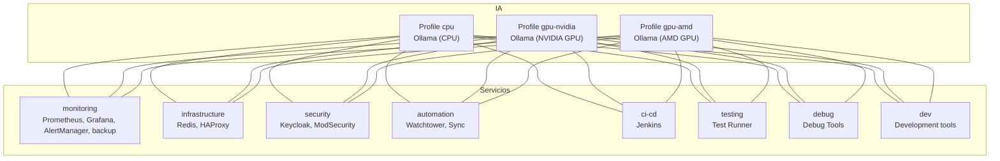
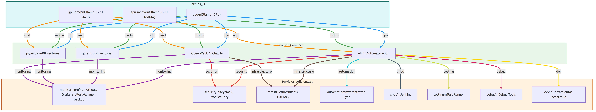
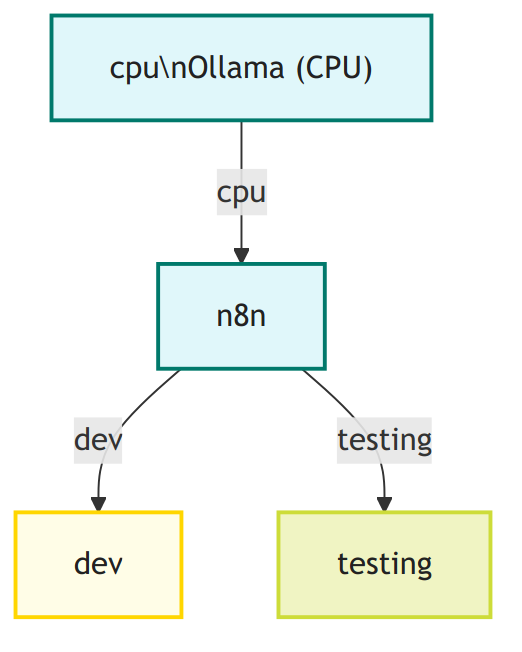
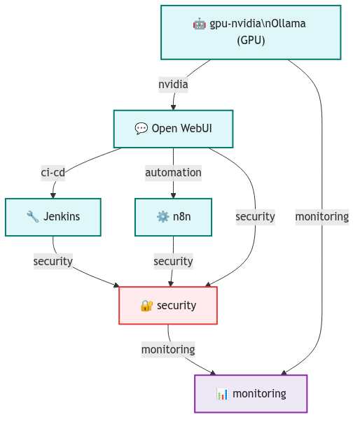
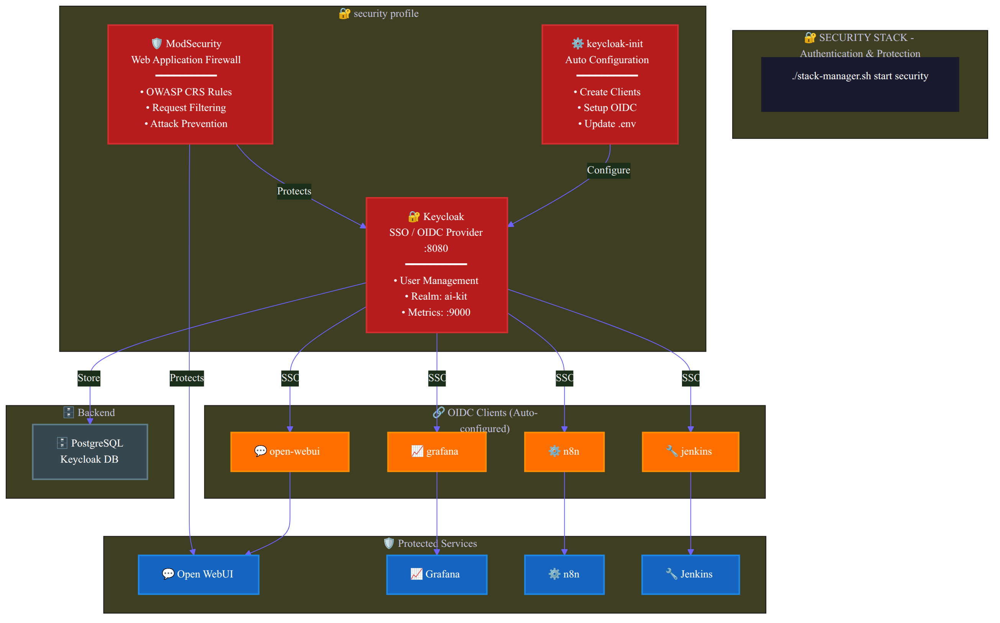
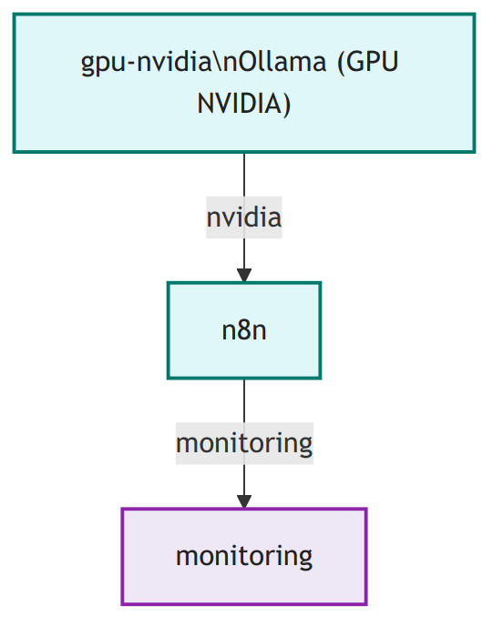
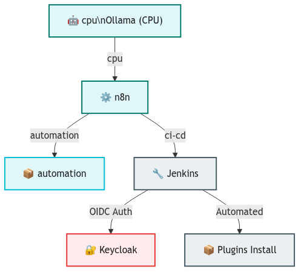
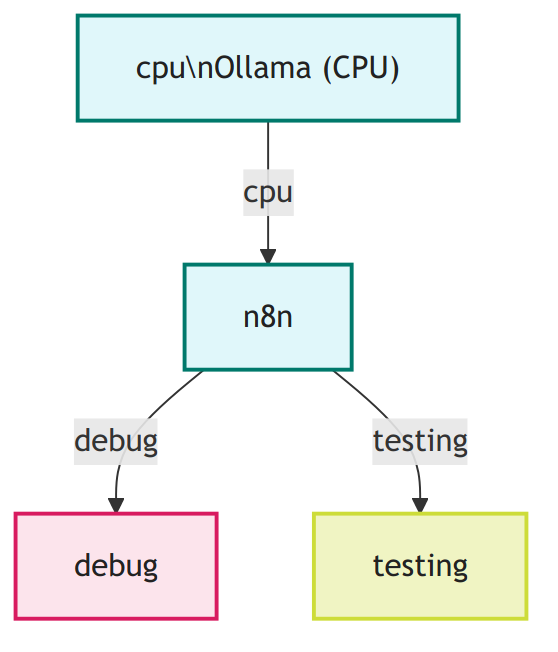
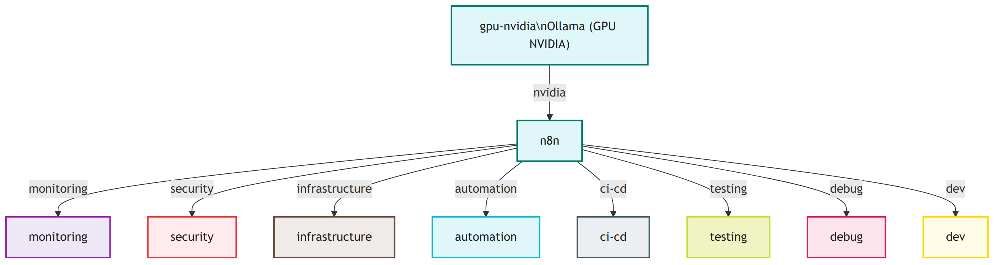

<!--
🌐 Language: English | [Español](README.es.md)
-->

> **This documentation is in English. For Spanish, see [README.es.md](README.es.md).**

# My Self-Hosted AI Kit

A complete stack of self-hosted Artificial Intelligence tools using Docker Compose. This project includes Ollama for local language models, n8n for automation, Open WebUI for chat interface, and more.

## 🚀 What does this stack include?

### Main services:
- **Ollama**: Local language model server (LLMs)
- **Open WebUI**: Modern web interface for AI chat
- **n8n**: Workflow automation platform
- **PostgreSQL**: Database for n8n
- **Qdrant**: Vector database for embeddings
- **pgvector**: PostgreSQL extension for vectors

### Optional services:
- **Automatic backup**: Daily data backup (profile `monitoring`)
- **Development tools**: Container with utilities (profile `dev`)

### Included AI models:
- llama3.2 (3.2B parameters - faster, less precise)
- llama3.3 (70.6B parameters - slower, more precise)
- all-minilm (embeddings model, auto-updates)
- deepseek-r1:14b (specialized model, optimized for 16GB VRAM)
- nomic-embed-text (text embeddings, auto-updates)

## 📋 Prerequisites

### Required software:
- **Docker Engine** (not Docker Desktop)
- **Docker Compose**
- **Git** (to clone the repository)

### Recommended hardware:
- **RAM**: Minimum 8GB, recommended 16GB+ (optimized for 96GB)
- **GPU**: NVIDIA with proprietary drivers (optimized for RTX 5060 Ti)
- **CPU**: Minimum 4 cores, recommended 8+ cores (optimized for Ryzen 7 7700)
- **Storage**: At least 50GB free (AI models are large)

## 🛠️ Installation

### 1. Clone the repository
```bash
git clone <your-repository>
cd my-selfhosted-ai-kit
```

### 2. Configure environment variables
Create a `.env` file in the project root:
```bash
# PostgreSQL Configuration
POSTGRES_USER=postgres
POSTGRES_PASSWORD=your_secure_password
POSTGRES_DB=n8n

# n8n Configuration
N8N_ENCRYPTION_KEY=your_32_character_encryption_key
N8N_USER_MANAGEMENT_JWT_SECRET=your_secure_jwt_secret
```

### 3. Configure GPU (optional)
If you have an NVIDIA GPU and want acceleration:

```bash
# Install nvidia-container-toolkit
sudo apt-get install -y nvidia-container-toolkit
sudo systemctl restart docker

# Verify it works
sudo docker run --rm --gpus all nvidia/cuda:12.0.0-base-ubuntu22.04 nvidia-smi
```

## 🚀 Usage

### Available profiles

The stack includes different profiles to optimize according to your needs:

#### Basic profile (CPU):
```bash
docker compose --profile cpu up -d
```

#### NVIDIA GPU profile (recommended for your RTX 5060 Ti):
```bash
docker compose --profile gpu-nvidia up -d
```

#### AMD GPU profile:
```bash
docker compose --profile gpu-amd up -d
```

#### Development profile:
```bash
docker compose --profile dev up -d
```

#### Monitoring and backup profile:
```bash
docker compose --profile monitoring up -d
```

#### Infrastructure profile (Redis, HAProxy):
```bash
docker compose --profile infrastructure up -d
```

#### Security profile (Keycloak, ModSecurity):
```bash
docker compose --profile security up -d
```

#### Automation profile (Watchtower, Sync):
```bash
docker compose --profile automation up -d
```

#### CI/CD profile (Jenkins):
```bash
docker compose --profile ci-cd up -d
```

#### Testing profile:
```bash
docker compose --profile testing up -d
```

#### Debugging profile:
```bash
docker compose --profile debug up -d
```

#### Combine multiple profiles:
```bash
# Full production with GPU, monitoring and infrastructure
docker compose --profile gpu-nvidia --profile monitoring --profile infrastructure up -d

# Development with tools and testing
docker compose --profile cpu --profile dev --profile testing up -d

# Full stack (watch out for resource usage!)
docker compose --profile gpu-nvidia --profile monitoring --profile infrastructure --profile security --profile automation up -d
```

## 🧩 What does each profile do and how to use them?

| Profile           | What does it include?                                                                 | When to use it?                                                                                   | Can it be combined?         |
|------------------|-------------------------------------------------------------------------------|---------------------------------------------------------------------------------------------------|----------------------------------|
| **cpu**          | Ollama (CPU)                                                                  | You don't have a GPU or want to save resources.                                                         | Yes, with other services.         |
| **gpu-nvidia**   | Ollama (NVIDIA GPU)                                                           | You have an NVIDIA GPU and want maximum AI performance.                                             | Yes, with other services.         |
| **gpu-amd**      | Ollama (AMD GPU)                                                              | You have a compatible AMD GPU.                                                                        | Yes, with other services.         |
| **monitoring**   | Prometheus, Grafana, AlertManager, automatic backup                          | You want monitoring, dashboards and automatic backups.                                            | Yes, with any profile.        |
| **infrastructure**| Redis, HAProxy                                                               | You need caching or load balancing.                                                              | Yes, with any profile.        |
| **security**     | Keycloak (authentication), ModSecurity (WAF)                                   | You want centralized authentication and web application firewall.                                | Yes, with any profile.        |
| **automation**   | Watchtower (auto-updates), Sync                                         | You want automation of updates and data synchronization.                              | Yes, with any profile.        |
| **ci-cd**        | Jenkins                                                                       | You need continuous integration and deployment pipelines.                                         | Yes, with any profile.        |
| **testing**      | Test Runner                                                                   | You want automatic service health monitoring.                                               | Yes, with any profile.        |
| **debug**        | Debug Tools                                                                   | You need advanced debugging tools.                                                    | Yes, with any profile.        |
| **dev**          | Development tools (curl, jq, etc.)                                   | You are developing or debugging the stack.                                                         | Yes, with any profile.        |

---

### 🔑 Should I run more than one profile at a time?

**Yes!**  
Each profile is modular and **you should combine them** according to your needs.  
For example, if you only run `security`, you'll have Keycloak and ModSecurity, but **you won't have AI, monitoring, or automation**.

#### Recommended combination examples:

- **Basic development (without GPU):**
  ```bash
  docker compose --profile cpu --profile dev up -d
  ```
- **AI with GPU and monitoring:**
  ```bash
  docker compose --profile gpu-nvidia --profile monitoring up -d
  ```
- **Full production (AI, monitoring, security, infrastructure):**
  ```bash
  docker compose --profile gpu-nvidia --profile monitoring --profile infrastructure --profile security up -d
  ```
- **Authentication and security only:**
  ```bash
  docker compose --profile security up -d
  ```

### 🗺️ Visual diagram of profiles and dependencies



### 🖼️ Image version



### 🗒️ Diagram color legend

- **Blue lines**: Connections from the `cpu` profile
- **Green lines**: Connections from the `gpu-nvidia` profile
- **Orange lines**: Connections from the `gpu-amd` profile
- **Purple lines**: Monitoring services (`monitoring`)
- **Red lines**: Security services (`security`)
- **Brown lines**: Infrastructure services (`infrastructure`)
- **Sky blue lines**: Automation services (`automation`)
- **Dark gray lines**: CI/CD services (`ci-cd`)
- **Lime green lines**: Testing services (`testing`)
- **Pink lines**: Debugging services (`debug`)
- **Yellow lines**: Development tools (`dev`)

---

### View logs in real time:
```bash
docker compose logs -f
```

### Manage the stack with the master script:
```bash
# Start services (default: gpu-nvidia + monitoring + infrastructure + security)
./scripts/stack-manager.sh start

# Start with specific profiles
./scripts/stack-manager.sh start gpu-nvidia monitoring

# View status
./scripts/stack-manager.sh status

# View help
./scripts/stack-manager.sh help
```

### Monitor model downloads:
```bash
./scripts/stack-manager.sh monitor
# Or directly:
./scripts/verifica_modelos.sh
```

### Stop all services:
```bash
docker compose down
# Or using stack-manager:
./scripts/stack-manager.sh stop
```

## 🌐 Access to applications

Once the services are running, you can access:

| Service | URL | Description |
|----------|-----|-------------|
| **Open WebUI** | http://localhost:3000 | Web interface for AI chat |
| **n8n** | http://localhost:5678 | Workflow automation |
| **Qdrant** | http://localhost:6333 | Vector database |
| **pgvector** | localhost:5433 | PostgreSQL with vectors |
| **Grafana** | http://localhost:3001 | Monitoring dashboards (monitoring profile) |
| **Prometheus** | http://localhost:9090 | System metrics (monitoring profile) |
| **AlertManager** | http://localhost:9093 | Alert management (monitoring profile) |
| **cAdvisor** | http://localhost:8082 | Container metrics (monitoring profile) |
| **Node Exporter** | http://localhost:9100 | Host metrics (monitoring profile) |
| **HAProxy** | http://localhost:80 | Load balancer (infrastructure profile) |
| **Redis** | localhost:6379 | Cache and sessions (infrastructure profile) |
| **Keycloak** | http://localhost:8080 | Centralized authentication (security profile) |
| **Jenkins** | http://localhost:8081 | CI/CD Pipeline (ci-cd profile) |

## 📚 Service usage guide

### Open WebUI
- **Purpose**: Modern web interface to interact with AI models
- **First use**: 
  1. Go to http://localhost:3000
  2. Create an account or sign in
  3. Select a model from the list
  4. Start chatting!

### n8n
- **Purpose**: Automate tasks and workflows
- **First use**:
  1. Go to http://localhost:5678
  2. Complete initial setup
  3. Create your first workflow
  4. Connect with Ollama to use AI in your automations

### Ollama
- **Purpose**: Local language model server
- **API**: http://localhost:11434
- **Available models**: Run `docker exec ollama ollama list`
- **Optimized for**: Your RTX 5060 Ti with 16GB VRAM

## 🔧 Useful commands

### Using the stack manager (recommended):
```bash
# Start services with default preset
./scripts/stack-manager.sh start

# View service status
./scripts/stack-manager.sh status

# View logs
./scripts/stack-manager.sh logs [service-name]

# Restart services
./scripts/stack-manager.sh restart [profiles...]

# Validate configuration
./scripts/stack-manager.sh validate

# Run full auto-validation
./scripts/stack-manager.sh auto-validate

# Test recent changes
./scripts/stack-manager.sh test

# Initialize volumes (first time only)
./scripts/stack-manager.sh init-volumes

# Monitor model downloads
./scripts/stack-manager.sh monitor
```

### Direct Docker Compose commands:
```bash
# View service status
docker compose ps

# View logs of a specific service
docker compose logs -f [service-name]
# Example: docker compose logs -f ollama

# Restart a service
docker compose restart [service-name]

# View resource usage
docker stats

# Clean up space (remove unused images)
docker system prune -a
```

### Keycloak management:
```bash
# Setup Keycloak for a service
./scripts/keycloak-manager.sh setup grafana
./scripts/keycloak-manager.sh setup n8n
./scripts/keycloak-manager.sh setup openwebui

# Show credentials
./scripts/keycloak-manager.sh credentials

# Create user
./scripts/keycloak-manager.sh create-user

# View status
./scripts/keycloak-manager.sh status

# View help
./scripts/keycloak-manager.sh help
```

## 📁 Volume structure

All data is stored in persistent Docker volumes:

- `n8n_storage`: n8n data (workflows, credentials)
- `ollama_storage`: Downloaded AI models
- `postgres_storage`: PostgreSQL database
- `qdrant_storage`: Vector database
- `open_webui_storage`: Open WebUI data
- `backup_data`: Automatic data backup
- `prometheus_data`: Monitoring metrics (optional)
- `grafana_data`: Grafana dashboards (optional)

## 🔧 Additional services

### Infrastructure (profile `infrastructure`)
- **Redis**: In-memory cache to improve performance
- **HAProxy**: Load balancer to distribute load between services

### Monitoring (profile `monitoring`)
- **Prometheus**: Metrics collector
- **Grafana**: Pre-configured dashboards:
  - **Ollama AI Models Dashboard**: Specific monitoring for AI models
  - **System Overview**: Complete system overview
- **AlertManager**: Alert management
- **Node Exporter**: Host metrics
- **cAdvisor**: Container metrics
- **PostgreSQL Exporter**: PostgreSQL metrics

### Security (profile `security`)
- **Keycloak**: Centralized authentication and authorization
- **ModSecurity**: Web Application Firewall (WAF)

### Automation (profile `automation`)
- **Watchtower**: Automatic container updates
- **Sync**: Automatic data synchronization

### CI/CD (profile `ci-cd`)
- **Jenkins**: Continuous integration and deployment pipeline

### Testing (profile `testing`)
- **Test Runner**: Automatic service health monitoring

### Debug (profile `debug`)
- **Debug Tools**: Advanced debugging tools

## 🚀 Hardware optimization

Your system has excellent specifications:
- **CPU**: AMD Ryzen 7 7700 (8 cores, 16 threads)
- **RAM**: 96GB DDR5
- **GPU**: NVIDIA RTX 5060 Ti

### Recommended configurations:

#### For maximum performance:
```bash
# Full stack with GPU
docker compose --profile gpu-nvidia --profile monitoring --profile infrastructure up -d
```

#### For development:
```bash
# Development stack with tools
docker compose --profile cpu --profile dev --profile testing up -d
```

#### For production:
```bash
# Production stack with security
docker compose --profile gpu-nvidia --profile monitoring --profile infrastructure --profile security up -d
```

## 🔒 Security

### Recommendations:
1. **Change default passwords** in the `.env` file
2. **Don't expose ports** to the Internet without additional configuration
3. **Use HTTPS** in production
4. **Keep containers updated**

### Sensitive variables:
- `POSTGRES_PASSWORD`: Database password
- `N8N_ENCRYPTION_KEY`: Key to encrypt n8n data
- `N8N_USER_MANAGEMENT_JWT_SECRET`: Key for JWT tokens

## 🐛 Troubleshooting

### Problem: "Cannot connect to Docker daemon"
```bash
sudo systemctl start docker
sudo usermod -aG docker $USER
# Log out and log back in
```

### Problem: GPU not working
```bash
# Verify NVIDIA drivers
nvidia-smi

# Verify Docker runtime
sudo docker run --rm --gpus all nvidia/cuda:12.0.0-base-ubuntu22.04 nvidia-smi
```

### Problem: Models not downloading
```bash
# View download container logs
docker logs ollama-pull-llama

# Download manually
docker exec -it ollama ollama pull llama3.2
```

### Problem: Port already in use
```bash
# See what's using the port
sudo netstat -tulpn | grep :3000

# Change port in docker-compose.yml
```

### Problem: Keycloak Login Failed ("Failed to get token")
This usually means Keycloak client secrets don't match.
```bash
# Force update of client secrets (keycloak-init runs automatically on start)
# If you need to manually trigger it:
docker compose --profile security up -d keycloak-init

# Or simply restart the security profile (keycloak-init will run automatically)
./scripts/stack-manager.sh restart security
```

### Problem: Grafana Login Failed ("InternalError")
This usually happens if the Keycloak user doesn't have an email address.
```bash
# Set email for admin user
docker exec keycloak /opt/keycloak/bin/kcadm.sh update users/$(docker exec keycloak /opt/keycloak/bin/kcadm.sh get users -r master -q username=admin --fields id --format csv --noquotes) -r master -s email=admin@example.com -s emailVerified=true
```

### Problem: Grafana Login Failed ("User sync failed")
This happens if Grafana cannot map the Keycloak user to an existing local user.
**Ensure the Grafana admin email matches the Keycloak admin email.**
1. Check Keycloak email (e.g., `admin@example.com`).
2. Update `.env` to match:
   ```bash
   GRAFANA_ADMIN_EMAIL=admin@example.com
   ```
3. Restart Grafana:
   ```bash
   ./scripts/stack-manager.sh start
   ```

### Problem: Very large logs
```bash
# Logs are configured to rotate automatically
# If you need to clean manually:
docker system prune -f
```

## 📈 Monitoring and maintenance

### Verify service health:
```bash
docker compose ps
```

### Data backup:
```bash
# Create backup (recommended)
./scripts/backup-manager.sh backup

# Create full backup with verification
./scripts/backup-manager.sh backup --full --verify

# List available backups
./scripts/backup-manager.sh list

# Restore from backup
./scripts/backup-manager.sh restore <timestamp>

# View help
./scripts/backup-manager.sh help
```

### Update services:
```bash
docker compose pull
docker compose up -d
```

### Monitor resource usage:
```bash
# View real-time usage
docker stats

# View logs of all services
docker compose logs -f
```

## 🛠️ Optional services

### Monitoring Profile (`monitoring`)
The `monitoring` profile adds a complete monitoring and observability stack:

#### Prometheus - Metrics collector
- **URL**: http://localhost:9090
- **Function**: Collects metrics from all stack services
- **Included metrics**: CPU, memory, health status, error logs

#### Grafana - Dashboards and visualization
- **URL**: http://localhost:3001
- **User**: admin
- **Password**: admin
- **Function**: Visual dashboards to monitor performance
- **Included dashboards**: Service metrics, resource usage, health status

#### AlertManager - Alert management
- **URL**: http://localhost:9093
- **Function**: Manages alerts when services have problems
- **Configured alerts**: Services down, high resource usage, critical errors

#### Automatic backup
- **Function**: Backs up data daily
- **Location**: `backup_data` volume
- **Frequency**: Every 24 hours

### Development tools
- **Profile**: `dev`
- **Function**: Container with curl, jq and other utilities
- **Usage**: For debugging and development

### How to use monitoring:

```bash
# Start full stack with monitoring
docker compose --profile gpu-nvidia --profile monitoring up -d

# Access Grafana
# 1. Go to http://localhost:3001
# 2. User: admin, Password: admin
# 3. Explore available dashboards

# Access Prometheus
# 1. Go to http://localhost:9090
# 2. Go to Status > Targets to see monitored services
# 3. Use the Graph tab to query metrics

# View alerts
# 1. Go to http://localhost:9093
# 2. Review active alerts and configuration
```

## 🤝 Contributing

1. Fork the project
2. Create a branch for your feature
3. Commit your changes
4. Push to the branch
5. Open a Pull Request

## 📄 License

This project is licensed under the MIT License. See the `LICENSE` file for more details.

## 🆘 Support

If you have problems:
1. Review the troubleshooting section
2. Check [docs/INDEX.md](docs/INDEX.md) for documentation guide
3. Search in the repository issues
4. Create a new issue with problem details

---

## 📚 Additional Documentation

For more information, see:
- **[docs/INDEX.md](docs/INDEX.md)** - Reading guide for all documentation
- **[TODO.md](TODO.md)** - Pending tasks list
- **[ESTADO_PROYECTO.md](ESTADO_PROYECTO.md)** - Current project status
- **[PROXIMOS_PASOS.md](PROXIMOS_PASOS.md)** - ⭐ **NEW** - Detailed action plan with recommended next steps

---

**Enjoy your self-hosted AI kit optimized for your powerful hardware! 🎉** 

## 📊 Visual examples of typical stacks

Below are visual examples of profile combinations for different usage scenarios. The source diagrams (.mmd) are in the `diagrams_mmd/` folder and the PNGs in `diagrams_png/`.

### Minimal development stack

- Only the essential services for local development without GPU.

### Full production stack

- Includes AI with GPU, monitoring, security, and infrastructure.

### Security and authentication only

- For when you only want to run Keycloak and ModSecurity.

### AI with GPU and monitoring

- For performance testing and observability.

### Automation and CI/CD stack

- For automated workflows and continuous integration pipelines.

### Debugging and testing stack

- For health monitoring and advanced debugging.

### Full stack (all services)

- All stack services running simultaneously.

---

**Want to create your own diagrams or modify the existing ones?**
See [`DIAGRAMS_INSTRUCTIONS.md`](DIAGRAMS_INSTRUCTIONS.md) for how to generate PNGs from `.mmd` files using Mermaid CLI. 
