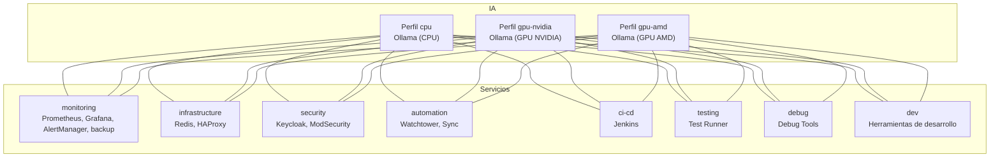

<!--
🌐 Language: English | [Español](README.es.md)
-->

> **This documentation is in English. For Spanish, see [README.es.md](README.es.md).**

# My Self-Hosted AI Kit

Un stack completo de herramientas de Inteligencia Artificial auto-hospedadas usando Docker Compose. Este proyecto incluye Ollama para modelos de lenguaje local, n8n para automatización, Open WebUI para interfaz de chat, y más.

## 🚀 ¿Qué incluye este stack?

### Servicios principales:
- **Ollama**: Servidor de modelos de lenguaje local (LLMs)
- **Open WebUI**: Interfaz web moderna para chat con IA
- **n8n**: Plataforma de automatización de flujos de trabajo
- **PostgreSQL**: Base de datos para n8n
- **Qdrant**: Base de datos vectorial para embeddings
- **pgvector**: Extensión de PostgreSQL para vectores

### Servicios opcionales:
- **Backup automático**: Respaldo diario de datos (perfil `monitoring`)
- **Herramientas de desarrollo**: Contenedor con utilidades (perfil `dev`)

### Modelos de IA incluidos:
- llama3.2 (modelo base)
- llama3.3 (modelo más avanzado)
- all-minilm (modelo de embeddings)
- deepseek-r1:14b (modelo especializado)
- nomic-embed-text (embeddings de texto)

## 📋 Prerrequisitos

### Software necesario:
- **Docker Engine** (no Docker Desktop)
- **Docker Compose**
- **Git** (para clonar el repositorio)

### Hardware recomendado:
- **RAM**: Mínimo 8GB, recomendado 16GB+ (optimizado para 96GB)
- **GPU**: NVIDIA con drivers propietarios (optimizado para RTX 5060 Ti)
- **CPU**: Mínimo 4 cores, recomendado 8+ cores (optimizado para Ryzen 7 7700)
- **Almacenamiento**: Al menos 50GB libres (los modelos de IA son grandes)

## 🛠️ Instalación

### 1. Clonar el repositorio
```bash
git clone <tu-repositorio>
cd my-selfhosted-ai-kit
```

### 2. Configurar variables de entorno
Crea un archivo `.env` en la raíz del proyecto:
```bash
# Configuración de PostgreSQL
POSTGRES_USER=postgres
POSTGRES_PASSWORD=tu_contraseña_segura
POSTGRES_DB=n8n

# Configuración de n8n
N8N_ENCRYPTION_KEY=tu_clave_de_encriptacion_32_caracteres
N8N_USER_MANAGEMENT_JWT_SECRET=tu_jwt_secret_seguro
```

### 3. Configurar GPU (opcional)
Si tienes GPU NVIDIA y quieres aceleración:

```bash
# Instalar nvidia-container-toolkit
sudo apt-get install -y nvidia-container-toolkit
sudo systemctl restart docker

# Verificar que funciona
sudo docker run --rm --gpus all nvidia/cuda:12.0.0-base-ubuntu22.04 nvidia-smi
```

## 🚀 Uso

### Perfiles disponibles

El stack incluye diferentes perfiles para optimizar según tus necesidades:

#### Perfil básico (CPU):
```bash
docker compose --profile cpu up -d
```

#### Perfil GPU NVIDIA (recomendado para tu RTX 5060 Ti):
```bash
docker compose --profile gpu-nvidia up -d
```

#### Perfil GPU AMD:
```bash
docker compose --profile gpu-amd up -d
```

#### Perfil de desarrollo:
```bash
docker compose --profile dev up -d
```

#### Perfil de monitoreo y respaldos:
```bash
docker compose --profile monitoring up -d
```

#### Perfil de infraestructura (Redis, HAProxy):
```bash
docker compose --profile infrastructure up -d
```

#### Perfil de seguridad (Keycloak, ModSecurity):
```bash
docker compose --profile security up -d
```

#### Perfil de automatización (Watchtower, Sync):
```bash
docker compose --profile automation up -d
```

#### Perfil de CI/CD (Jenkins):
```bash
docker compose --profile ci-cd up -d
```

#### Perfil de testing:
```bash
docker compose --profile testing up -d
```

#### Perfil de debugging:
```bash
docker compose --profile debug up -d
```

#### Combinar múltiples perfiles:
```bash
# Producción completa con GPU, monitoreo e infraestructura
docker compose --profile gpu-nvidia --profile monitoring --profile infrastructure up -d

# Desarrollo con herramientas y testing
docker compose --profile cpu --profile dev --profile testing up -d

# Stack completo (¡cuidado con el uso de recursos!)
docker compose --profile gpu-nvidia --profile monitoring --profile infrastructure --profile security --profile automation up -d
```

## 🧩 ¿Qué hace cada perfil y cómo usarlos?

| Perfil           | ¿Qué incluye?                                                                 | ¿Cuándo usarlo?                                                                                   | ¿Se recomienda combinar?         |
|------------------|-------------------------------------------------------------------------------|---------------------------------------------------------------------------------------------------|----------------------------------|
| **cpu**          | Ollama (CPU)                                                                  | No tienes GPU o quieres ahorrar recursos.                                                         | Sí, con otros servicios.         |
| **gpu-nvidia**   | Ollama (GPU NVIDIA)                                                           | Tienes GPU NVIDIA y quieres máximo rendimiento en IA.                                             | Sí, con otros servicios.         |
| **gpu-amd**      | Ollama (GPU AMD)                                                              | Tienes GPU AMD compatible.                                                                        | Sí, con otros servicios.         |
| **monitoring**   | Prometheus, Grafana, AlertManager, backup automático                          | Quieres monitoreo, dashboards y respaldos automáticos.                                            | Sí, con cualquier perfil.        |
| **infrastructure**| Redis, HAProxy                                                               | Necesitas cache o balanceo de carga.                                                              | Sí, con cualquier perfil.        |
| **security**     | Keycloak (autenticación), ModSecurity (WAF)                                   | Quieres autenticación centralizada y firewall de aplicaciones web.                                | Sí, con cualquier perfil.        |
| **automation**   | Watchtower (auto-actualización), Sync                                         | Quieres automatización de actualizaciones y sincronización de datos.                              | Sí, con cualquier perfil.        |
| **ci-cd**        | Jenkins                                                                       | Necesitas pipelines de integración y despliegue continuo.                                         | Sí, con cualquier perfil.        |
| **testing**      | Test Runner                                                                   | Quieres monitoreo automático de salud de servicios.                                               | Sí, con cualquier perfil.        |
| **debug**        | Debug Tools                                                                   | Necesitas herramientas avanzadas de debugging.                                                    | Sí, con cualquier perfil.        |
| **dev**          | Herramientas de desarrollo (curl, jq, etc.)                                   | Estás desarrollando o depurando el stack.                                                         | Sí, con cualquier perfil.        |

---

### 🔑 ¿Debo levantar más de un perfil a la vez?

**¡Sí!**  
Cada perfil es modular y **debes combinarlos** según tus necesidades.  
Por ejemplo, si solo levantas `security`, tendrás Keycloak y ModSecurity, pero **no tendrás IA, ni monitoreo, ni automatización**.

#### Ejemplos de combinaciones recomendadas:

- **Desarrollo básico (sin GPU):**
  ```bash
  docker compose --profile cpu --profile dev up -d
  ```
- **IA con GPU y monitoreo:**
  ```bash
  docker compose --profile gpu-nvidia --profile monitoring up -d
  ```
- **Producción completa (IA, monitoreo, seguridad, infraestructura):**
  ```bash
  docker compose --profile gpu-nvidia --profile monitoring --profile infrastructure --profile security up -d
  ```
- **Solo autenticación y seguridad:**
  ```bash
  docker compose --profile security up -d
  ```

### 🗺️ Diagrama visual de perfiles y dependencias



### 🖼️ Versión en imagen


### 🗒️ Leyenda de colores del diagrama

- **Líneas azules**: Conexiones desde el perfil `cpu`
- **Líneas verdes**: Conexiones desde el perfil `gpu-nvidia`
- **Líneas naranjas**: Conexiones desde el perfil `gpu-amd`
- **Líneas moradas**: Servicios de monitoreo (`monitoring`)
- **Líneas rojas**: Servicios de seguridad (`security`)
- **Líneas marrones**: Servicios de infraestructura (`infrastructure`)
- **Líneas celestes**: Servicios de automatización (`automation`)
- **Líneas gris oscuro**: Servicios de CI/CD (`ci-cd`)
- **Líneas verde lima**: Servicios de testing (`testing`)
- **Líneas rosas**: Servicios de debugging (`debug`)
- **Líneas amarillas**: Herramientas de desarrollo (`dev`)

---

### Ver logs en tiempo real:
```bash
docker compose logs -f
```

### Monitorear descarga de modelos:
```bash
./verifica_modelos.sh
```

### Detener todos los servicios:
```bash
docker compose down
```

## 🌐 Acceso a las aplicaciones

Una vez que los servicios estén corriendo, puedes acceder a:

| Servicio | URL | Descripción |
|----------|-----|-------------|
| **Open WebUI** | http://localhost:3000 | Interfaz web para chat con IA |
| **n8n** | http://localhost:5678 | Automatización de flujos de trabajo |
| **Qdrant** | http://localhost:6333 | Base de datos vectorial |
| **pgvector** | localhost:5433 | PostgreSQL con vectores |
| **Grafana** | http://localhost:3001 | Dashboards de monitoreo (perfil monitoring) |
| **Prometheus** | http://localhost:9090 | Métricas del sistema (perfil monitoring) |
| **AlertManager** | http://localhost:9093 | Gestión de alertas (perfil monitoring) |
| **cAdvisor** | http://localhost:8082 | Métricas de contenedores (perfil monitoring) |
| **Node Exporter** | http://localhost:9100 | Métricas del host (perfil monitoring) |
| **HAProxy** | http://localhost:80 | Load balancer (perfil infrastructure) |

| **Redis** | localhost:6379 | Cache y sesiones (perfil infrastructure) |
| **Keycloak** | http://localhost:8080 | Autenticación centralizada (perfil security) |
| **Jenkins** | http://localhost:8081 | CI/CD Pipeline (perfil ci-cd) |

## 📚 Guía de uso por servicio

### Open WebUI
- **Propósito**: Interfaz web moderna para interactuar con modelos de IA
- **Primer uso**: 
  1. Ve a http://localhost:3000
  2. Crea una cuenta o inicia sesión
  3. Selecciona un modelo de la lista
  4. ¡Comienza a chatear!

### n8n
- **Propósito**: Automatizar tareas y flujos de trabajo
- **Primer uso**:
  1. Ve a http://localhost:5678
  2. Completa la configuración inicial
  3. Crea tu primer workflow
  4. Conecta con Ollama para usar IA en tus automatizaciones

### Ollama
- **Propósito**: Servidor de modelos de lenguaje local
- **API**: http://localhost:11434
- **Modelos disponibles**: Ejecuta `docker exec ollama ollama list`
- **Optimizado para**: Tu RTX 5060 Ti con 16GB VRAM

## 🔧 Comandos útiles

### Ver estado de los servicios:
```bash
docker compose ps
```

### Ver logs de un servicio específico:
```bash
docker compose logs -f [nombre-servicio]
# Ejemplo: docker compose logs -f ollama
```

### Reiniciar un servicio:
```bash
docker compose restart [nombre-servicio]
```

### Ver uso de recursos:
```bash
docker stats
```

### Limpiar espacio (eliminar imágenes no usadas):
```bash
docker system prune -a
```

### Verificar salud de los servicios:
```bash
docker compose ps
```

## 📁 Estructura de volúmenes

Todos los datos se almacenan en volúmenes persistentes de Docker:

- `n8n_storage`: Datos de n8n (workflows, credenciales)
- `ollama_storage`: Modelos de IA descargados
- `postgres_storage`: Base de datos PostgreSQL
- `qdrant_storage`: Base de datos vectorial
- `open_webui_storage`: Datos de Open WebUI
- `backup_data`: Respaldo automático de datos
- `prometheus_data`: Métricas de monitoreo (opcional)
- `grafana_data`: Dashboards de Grafana (opcional)

## 🔧 Servicios adicionales

### Infraestructura (perfil `infrastructure`)
- **Redis**: Cache en memoria para mejorar rendimiento
- **HAProxy**: Load balancer para distribuir carga entre servicios

### Monitoreo (perfil `monitoring`)
- **Prometheus**: Recolector de métricas
- **Grafana**: Dashboards pre-configurados:
  - **Ollama AI Models Dashboard**: Monitoreo específico de modelos de IA
  - **System Overview**: Vista general del sistema completo
- **AlertManager**: Gestión de alertas
- **Node Exporter**: Métricas del host
- **cAdvisor**: Métricas de contenedores
- **PostgreSQL Exporter**: Métricas de PostgreSQL

### Seguridad (perfil `security`)
- **Keycloak**: Autenticación y autorización centralizada
- **ModSecurity**: Firewall de aplicaciones web (WAF)

### Automatización (perfil `automation`)
- **Watchtower**: Actualizaciones automáticas de contenedores
- **Sync**: Sincronización automática de datos

### CI/CD (perfil `ci-cd`)
- **Jenkins**: Pipeline de integración y despliegue continuo

### Testing (perfil `testing`)
- **Test Runner**: Monitoreo automático de salud de servicios

### Debug (perfil `debug`)
- **Debug Tools**: Herramientas avanzadas de debugging

## 🚀 Optimización para tu hardware

Tu sistema tiene especificaciones excelentes:
- **CPU**: AMD Ryzen 7 7700 (8 cores, 16 threads)
- **RAM**: 96GB DDR5
- **GPU**: NVIDIA RTX 5060 Ti

### Configuraciones recomendadas:

#### Para máximo rendimiento:
```bash
# Stack completo con GPU
docker compose --profile gpu-nvidia --profile monitoring --profile infrastructure up -d
```

#### Para desarrollo:
```bash
# Stack de desarrollo con herramientas
docker compose --profile cpu --profile dev --profile testing up -d
```

#### Para producción:
```bash
# Stack de producción con seguridad
docker compose --profile gpu-nvidia --profile monitoring --profile infrastructure --profile security up -d
```

## 🔒 Seguridad

### Recomendaciones:
1. **Cambia las contraseñas por defecto** en el archivo `.env`
2. **No expongas los puertos** a Internet sin configuración adicional
3. **Usa HTTPS** en producción
4. **Mantén actualizados** los contenedores

### Variables sensibles:
- `POSTGRES_PASSWORD`: Contraseña de la base de datos
- `N8N_ENCRYPTION_KEY`: Clave para encriptar datos de n8n
- `N8N_USER_MANAGEMENT_JWT_SECRET`: Clave para tokens JWT

## 🐛 Solución de problemas

### Problema: "Cannot connect to Docker daemon"
```bash
sudo systemctl start docker
sudo usermod -aG docker $USER
# Cierra sesión y vuelve a entrar
```

### Problema: GPU no funciona
```bash
# Verificar drivers NVIDIA
nvidia-smi

# Verificar runtime de Docker
sudo docker run --rm --gpus all nvidia/cuda:12.0.0-base-ubuntu22.04 nvidia-smi
```

### Problema: Modelos no se descargan
```bash
# Ver logs del contenedor de descarga
docker logs ollama-pull-llama

# Descargar manualmente
docker exec -it ollama ollama pull llama3.2
```

### Problema: Puerto ya en uso
```bash
# Ver qué usa el puerto
sudo netstat -tulpn | grep :3000

# Cambiar puerto en docker-compose.yml
```

### Problema: Logs muy grandes
```bash
# Los logs están configurados para rotar automáticamente
# Si necesitas limpiar manualmente:
docker system prune -f
```

## 📈 Monitoreo y mantenimiento

### Verificar salud de los servicios:
```bash
docker compose ps
```

### Backup de datos:
```bash
# Backup manual de volúmenes
docker run --rm -v my-selfhosted-ai-kit_n8n_storage:/data -v $(pwd):/backup alpine tar czf /backup/n8n_backup.tar.gz -C /data .

# Backup automático (con perfil monitoring)
docker compose --profile monitoring up -d
```

### Actualizar servicios:
```bash
docker compose pull
docker compose up -d
```

### Monitorear uso de recursos:
```bash
# Ver uso en tiempo real
docker stats

# Ver logs de todos los servicios
docker compose logs -f
```

## 🛠️ Servicios opcionales

### Perfil de Monitoreo (`monitoring`)
El perfil `monitoring` agrega un stack completo de monitoreo y observabilidad:

#### Prometheus - Recolector de métricas
- **URL**: http://localhost:9090
- **Función**: Recolecta métricas de todos los servicios del stack
- **Métricas incluidas**: CPU, memoria, estado de salud, logs de errores

#### Grafana - Dashboards y visualización
- **URL**: http://localhost:3001
- **Usuario**: admin
- **Contraseña**: admin
- **Función**: Dashboards visuales para monitorear el rendimiento
- **Dashboards incluidos**: Métricas de servicios, uso de recursos, estado de salud

#### AlertManager - Gestión de alertas
- **URL**: http://localhost:9093
- **Función**: Gestiona alertas cuando los servicios tienen problemas
- **Alertas configuradas**: Servicios caídos, alto uso de recursos, errores críticos

#### Backup automático
- **Función**: Respalda datos diariamente
- **Ubicación**: Volumen `backup_data`
- **Frecuencia**: Cada 24 horas

### Herramientas de desarrollo
- **Perfil**: `dev`
- **Función**: Contenedor con curl, jq y otras utilidades
- **Uso**: Para debugging y desarrollo

### Cómo usar el monitoreo:

```bash
# Levantar stack completo con monitoreo
docker compose --profile gpu-nvidia --profile monitoring up -d

# Acceder a Grafana
# 1. Ve a http://localhost:3001
# 2. Usuario: admin, Contraseña: admin
# 3. Explora los dashboards disponibles

# Acceder a Prometheus
# 1. Ve a http://localhost:9090
# 2. Ve a Status > Targets para ver servicios monitoreados
# 3. Usa la pestaña Graph para consultar métricas

# Ver alertas
# 1. Ve a http://localhost:9093
# 2. Revisa alertas activas y configuración
```

## 🤝 Contribuir

1. Fork el proyecto
2. Crea una rama para tu feature
3. Commit tus cambios
4. Push a la rama
5. Abre un Pull Request

## 📄 Licencia

Este proyecto está bajo la Licencia MIT. Ver el archivo `LICENSE` para más detalles.

## 🆘 Soporte

Si tienes problemas:
1. Revisa la sección de solución de problemas
2. Busca en los issues del repositorio
3. Crea un nuevo issue con detalles del problema

---

**¡Disfruta tu kit de IA auto-hospedado optimizado para tu hardware potente! 🎉** 

## 📊 Visual examples of typical stacks

Below are visual examples of profile combinations for different usage scenarios. The source diagrams (.mmd) are in the `diagrams_mmd/` folder and the PNGs in `diagrams_png/`.

### Minimal development stack

- Only the essential services for local development without GPU.

### Full production stack

- Includes AI with GPU, monitoring, security, and infrastructure.

### Security and authentication only

- For when you only want to run Keycloak and ModSecurity.

### AI with GPU and monitoring

- For performance testing and observability.

### Automation and CI/CD stack

- For automated workflows and continuous integration pipelines.

### Debugging and testing stack

- For health monitoring and advanced debugging.

### Full stack (all services)

- All stack services running simultaneously.

---

**Want to create your own diagrams or modify the existing ones?**
See [`DIAGRAMS_INSTRUCTIONS.md`](DIAGRAMS_INSTRUCTIONS.md) for how to generate PNGs from `.mmd` files using Mermaid CLI. 